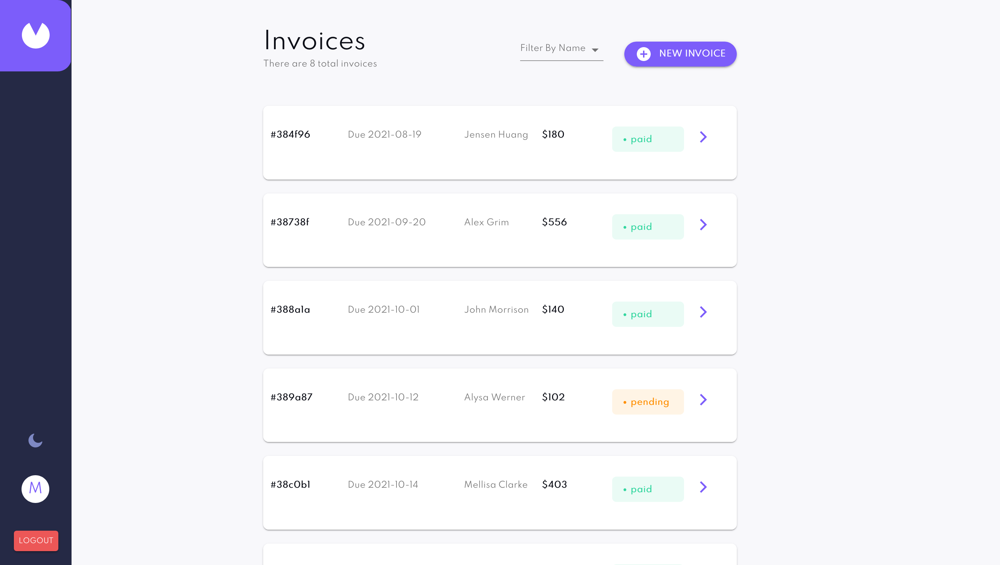

<h1>Invocies_app</h1>

This full-stack invoicing application the user can Create, read, update, and delete invoices,
Receive form validations when trying to create/edit an invoice, Save draft invoices, and mark pending invoices as paid, Filter invoices by status (draft/pending/paid), Toggle light and dark mode.

## Links

- [Repo](https://github.com/mohamednasr20/invoce_app_mern "invoce_app_mern Repo")

- [Live](https://invoiceweb.netlify.app "Live View")

## Built With

- React.js
- Redux
- Express.js
- MangoDB
- Material-Ui

## Screenshots

